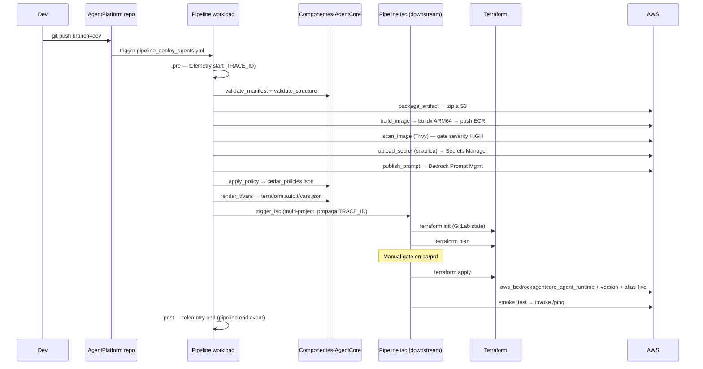
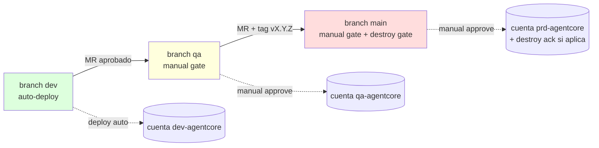
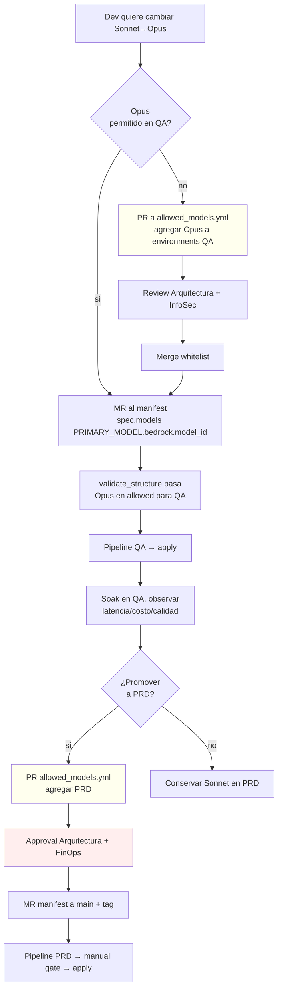
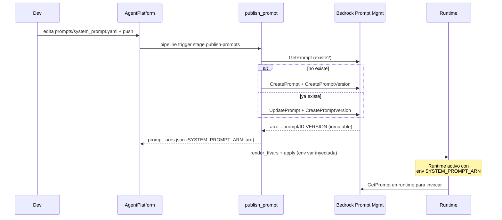
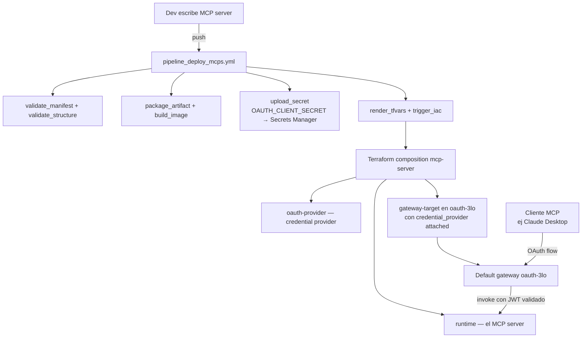
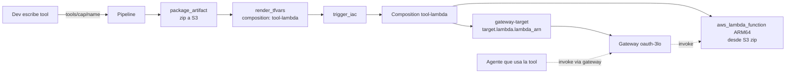
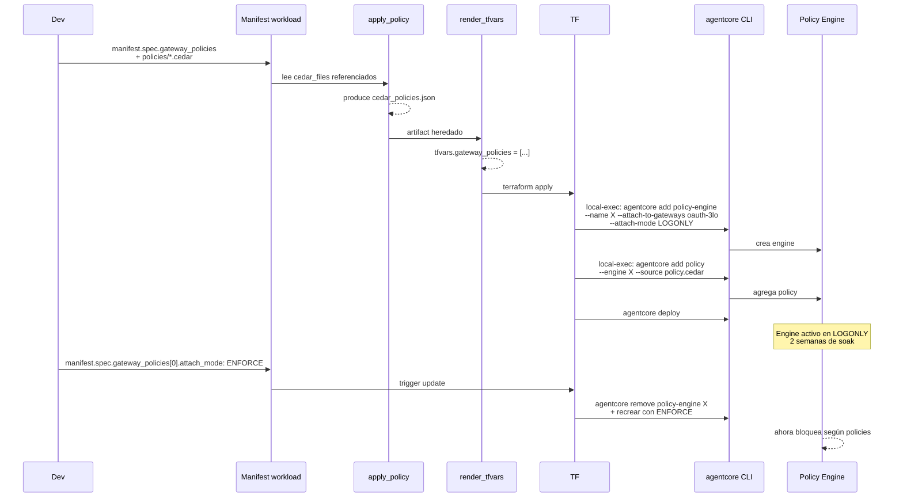
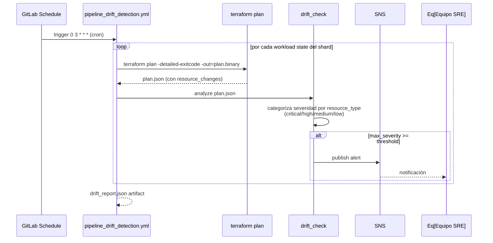
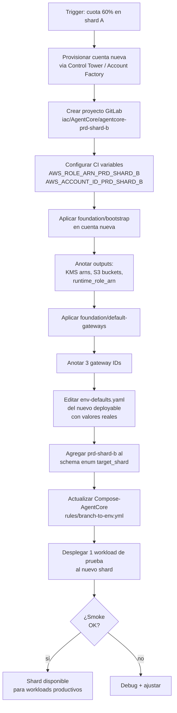
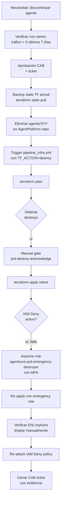

# Flujos y Diagramas

> Diagramas Mermaid + paso a paso de los flujos críticos de la plataforma. Cada flujo termina con "qué hacer si falla".

## Índice de flujos

1. [Despliegue end-to-end de un agente nuevo](#1-despliegue-end-to-end-de-un-agente-nuevo)
2. [Promoción dev → qa → prd](#2-promoción-dev--qa--prd)
3. [Cambio de modelo en un agente existente](#3-cambio-de-modelo-en-un-agente-existente)
4. [Cambio de prompt en un agente existente](#4-cambio-de-prompt-en-un-agente-existente)
5. [Despliegue de un MCP server con OAuth](#5-despliegue-de-un-mcp-server-con-oauth)
6. [Despliegue de una tool como Lambda](#6-despliegue-de-una-tool-como-lambda)
7. [Aplicar Cedar policies a un gateway](#7-aplicar-cedar-policies-a-un-gateway)
8. [Drift detection nightly](#8-drift-detection-nightly)
9. [Agregar shard nuevo (multi-account)](#9-agregar-shard-nuevo-multi-account)
10. [Destroy en PRD (caso excepcional)](#10-destroy-en-prd-caso-excepcional)

---

## 1. Despliegue end-to-end de un agente nuevo

### Diagrama



### Paso a paso

**Pre-condiciones:**
- Cuenta `dev-agentcore` con `foundation/bootstrap` aplicado.
- Variables CI/CD configuradas (ver `CI_VARIABLES.md` Fase B).
- Repos GitLab existen con permisos.

**Steps:**

1. **Dev escribe** `agents/{capability}/{name}/manifest.yaml` desde `_template/`. Define `composition`, `runtime.entrypoint`, `models[]`, prompts si aplica.
2. **Dev escribe** `src/agent.py` con FastAPI exponiendo `/invocations` y `/ping`.
3. **Dev hace push** a branch `dev`. GitLab dispara `AgentPlatform/.gitlab-ci.yml`.
4. **`.gitlab-ci.yml` incluye** `Compose-AgentCore/pipeline_deploy_agents.yml`.
5. **`pipeline_deploy_agents.yml` ejecuta** los stages en orden:
   - `.pre`: `pipeline_telemetry` genera TRACE_ID, escribe `telemetry.env` (heredado por todos los siguientes).
   - `validate`: `validate_manifest` (JSON-schema) + `validate_structure` (cross-validation contra `composition_map.yml` y `allowed_models.yml`).
   - `package`: zipea `src/`, sube a `s3://artifacts-dev-agentcore-agents/{capability}/{name}/{sha}.zip`. Produce `artifact_meta.json`.
   - `build`: descarga zip, `docker buildx build --platform linux/arm64`, push a ECR `agentcore-agents-{capability}-{name}:{sha}`. Produce `image_meta.json`.
   - `scan`: Trivy escanea la imagen, falla si severity ≥ HIGH.
   - `secrets`: si manifest declara OAuth provider, sube `OAUTH_CLIENT_SECRET` a Secrets Manager con KMS dedicado.
   - `publish-prompts`: para cada `prompts/*.yaml`, llama Bedrock SDK `create_prompt` + `create_prompt_version`. Produce `prompt_arns.json`.
   - `render`:
     - `apply_policy` lee `policies/*.cedar` referenciados en manifest, produce `cedar_policies.json`.
     - `render_tfvars` consume manifest + env-defaults + meta files + cedar_policies + prompt_arns → produce `terraform.auto.tfvars.json` y `composition_name.txt`.
   - `deploy`: `trigger_iac` dispara pipeline downstream del deployable `agentcore-dev` con CI variables: TFVARS_JSON, COMPOSITION_NAME, INFRA_REF, TRACE_ID.
6. **Pipeline downstream** (`pipeline_infra.yml` en `agentcore-dev`):
   - Clona `Infra-AgentCore` en `INFRA_REF` (tag o main).
   - `terraform init` con backend GitLab state (state name único por workload).
   - `terraform plan` (en dev, automático; en qa/prd manual gate).
   - `terraform apply` crea: `aws_bedrockagentcore_agent_runtime` + `_version` + `_alias` (live), `aws_iam_role` (si runtime_iam declarado), `aws_bedrockagentcore_memory` (si composition lo incluye), etc.
   - Output `tf_outputs.json` con ARNs.
7. **Smoke test**: `aws bedrock-agentcore invoke-agent-runtime` con payload `{"prompt":"ping"}`. Espera 200.
8. **Telemetry end**: `pipeline_telemetry emit_end` publica evento `pipeline.end` con status final y duración total a CloudWatch Logs.

### Qué hacer si falla

| Stage | Síntoma | Acción |
|---|---|---|
| `validate` | "composition no existe" | Verificar typo en `manifest.spec.composition` |
| `validate` | "model_id NO está en allowed_models" | Pedir PR a `allowed_models.yml` |
| `package` | error S3 | Verificar `AWS_ROLE_ARN_DEV` y permisos s3:PutObject |
| `build` | error buildx | Verificar runner ARM disponible o config QEMU |
| `scan` | "vulnerabilidad CRITICAL" | Actualizar dependencias del workload o pedir excepción |
| `render` | "inline policy file no existe" | El manifest referencia un archivo IAM que no está en el repo |
| Downstream `terraform-plan` | "resource AlreadyExists" | Drift entre state y AWS — investigar con drift_detection |
| `smoke_test` | "/ping" no responde | El agente no expone los endpoints requeridos en puerto 8080 |

---

## 2. Promoción dev → qa → prd

### Diagrama



### Paso a paso

1. **Dev push a `dev`**: deploy automático en cuenta DEV. No requiere approval.
2. **Cuando dev funciona**: Dev abre MR `dev → qa`.
3. **Reviewer aprueba** el MR (revisa diff del manifest + tests).
4. **Merge a `qa`**: pipeline corre, llega a `terraform-apply` que aparece como **manual** (botón en GitLab UI).
5. **Approver clickea** el botón → apply en cuenta QA → smoke test.
6. **Cuando qa estable**: Dev abre MR `qa → main` Y crea **tag semver** `vX.Y.Z` en main.
7. **Pipeline en main con tag**: corre hasta plan. Si plan tiene destroys, aparece job `prd-destroy-acknowledge` (manual).
8. **Approver clickea destroy-acknowledge** (si aplica) → luego `terraform-apply` (manual también) → apply en cuenta PRD.
9. **Smoke test en PRD**: invoke /ping con cuenta PRD role.
10. **Catalog**: en main, `pipeline_catalog.yml` publica metadata a LeanIX.

### Reglas de protección por branch

| Branch | Protected | Push directo | Min approvers MR |
|---|---|---|---|
| `dev` | sí | desarrolladores autorizados | 1 |
| `qa` | sí | NO | 1 (lead) |
| `main` | sí | NO | 2 (lead + arquitectura) |

---

## 3. Cambio de modelo en un agente existente

### Diagrama



### Paso a paso

1. **Dev edita** `manifest.yaml`: cambia `spec.models[0].bedrock.model_id` de `claude-3-5-sonnet` a `claude-3-opus`.
2. **`validate_structure` chequea** `allowed_models.yml`: ¿está Opus permitido en el ambiente target?
3. **Si NO está**: `validate_structure` falla con "no permitido en QA". Dev abre PR a `Componentes-AgentCore/config_files/allowed_models.yml` agregando el ambiente al `environments` de Opus. Review por Arquitectura/InfoSec/FinOps. Merge.
4. **Si SÍ está**: pipeline QA pasa, deploy automático (manual gate típicamente).
5. **Soak en QA**: observar telemetría, latencia, costo. Comparar con Sonnet.
6. **Si Opus gana**: repetir whitelist PR para PRD (FinOps approval típicamente requerido).
7. **MR a main + tag semver**, deploy PRD con manual gate.

### Por qué este flujo es seguro

- **El cambio NO toca código Python.** El agente sigue leyendo `os.environ["PRIMARY_MODEL_ID"]`.
- **Audit trail completo:** git log muestra quién cambió, cuándo, qué (modelo viejo → nuevo), y la aprobación queda en el MR.
- **Whitelist es el control de gobierno:** sin estar en whitelist, validate_structure rechaza el deploy. Cambiar la whitelist requiere review independiente.

---

## 4. Cambio de prompt en un agente existente

### Diagrama



### Paso a paso

1. **Dev edita** `prompts/system_prompt.yaml` (cambia el `text` o `variants`).
2. **Push** → pipeline corre.
3. **`publish_prompt` stage**:
   - SDK Bedrock `list_prompts`, busca el nombre `{env}-{capability}-{workload}-{prompt_filename}`.
   - Si existe: `update_prompt` con nuevo contenido. Si no: `create_prompt`.
   - Siempre: `create_prompt_version` (Bedrock crea versión inmutable nueva con número incremental).
   - Escribe `prompt_arns.json` con `{SYSTEM_PROMPT_ARN: "arn:...:prompt/ID:5"}`.
4. **`render_tfvars` lee** `prompt_arns.json` y agrega los ARNs al `runtime.env_vars`.
5. **`terraform apply`**: actualiza el runtime con la nueva env var. Como cambia un atributo del runtime, se crea **nueva versión** del runtime y el alias `live` se mueve.
6. **Runtime activo**: el código del agente lee `os.environ["SYSTEM_PROMPT_ARN"]` y lo usa con `bedrock-runtime.get_prompt(promptIdentifier=...)` para resolver el contenido del prompt en runtime.

### Por qué SDK y no Terraform

Ya está documentado en `MANIFEST_REFERENCE.md §3`. TL;DR: prompts cambian decenas de veces más seguido que la infra. Versionado nativo de Bedrock + SDK = audit trail sin saturar Terraform state.

### Rollback de prompt

1. Bedrock Prompt Management mantiene todas las versiones inmutables.
2. Para volver a versión vieja: edit `manifest` apuntando a versión específica del ARN, O re-edit el `prompts/*.yaml` al contenido viejo (creará nueva versión semánticamente igual a la antigua).

---

## 5. Despliegue de un MCP server con OAuth

### Diagrama



### Paso a paso

1. **Dev escribe** `mcp/{capability}/{name}/manifest.yaml`:
   - `kind: mcp`
   - `composition: mcp-server`
   - `gateway_targets: [{ gateway: oauth-3lo }]`
   - `oauth_provider: { client_id, issuer, ... }`
2. **CI variable** `OAUTH_CLIENT_SECRET` configurada como masked en GitLab project (con scope per environment).
3. **`upload_secret` stage**: sube el client_secret a `agentcore/{env}/{capability}/{name}/oauth-client` en Secrets Manager con KMS.
4. **`render_tfvars`** produce tfvars con `oauth_provider.client_secret_arn` apuntando al ARN del secreto creado.
5. **Composition `mcp-server`** crea:
   - `module "runtime"` (el MCP server image)
   - `module "oauth_provider"` (`aws_bedrockagentcore_oauth2_credential_provider`)
   - `module "gateway_targets"` con `credential_provider_configurations` apuntando al provider
6. **Cliente MCP** (ej: Claude Desktop) inicia OAuth flow contra el gateway. JWT válido → request enrutado al MCP runtime.

### Cómo el cliente sabe la URL del gateway

`module.gateway` (en foundation/default-gateways) tiene output `gateway_url`. Ese URL se distribuye a clientes MCP fuera del flow del pipeline (manualmente o via MCP discovery).

---

## 6. Despliegue de una tool como Lambda

### Diagrama



### Paso a paso

1. **Dev escribe** en `tools/{capability}/{name}/`:
   - `manifest.yaml` con `kind: tools`, `composition: tool-lambda`, `tool: { kind: lambda, handler: tool.handler }`, `gateway_targets[]`.
   - `src/tool.py` con función `def handler(event, context): ...`.
   - `src/requirements.txt` con dependencias.
2. **`package_artifact`**: zipea `src/`, sube a S3.
3. **`render_tfvars`**: composition `tool-lambda`, tfvars con `artifact_s3_bucket` + `artifact_s3_key`.
4. **Composition `tool-lambda`**:
   - `module "lambda"` crea `aws_lambda_function` ARM64 con package del S3.
   - `module "gateway_targets"` registra la Lambda como target con `target_configuration.mcp.lambda.lambda_arn`.
5. **Agentes que la consumen**: invocan via gateway. La Lambda procesa, devuelve respuesta.

### Cuándo usar embedded vs Lambda vs OpenAPI

Ver `MANIFEST_REFERENCE.md §3.quater`. Resumen:
- **Embedded**: tool simple, comparte estado del agente. Sin infra.
- **Lambda**: tool pesada, escala separado, reusable entre agentes. Esta composition.
- **OpenAPI**: HTTP API ya existente. Composition `agent-with-tools` con `tools_schema` apuntando a OpenAPI en S3.

---

## 7. Aplicar Cedar policies a un gateway

### Diagrama



### Paso a paso

1. **Dev escribe** `policies/*.cedar` files en su workload.
2. **Manifest** declara:
   ```yaml
   gateway_policies:
     - gateway: oauth-3lo
       attach_mode: LOGONLY        # ⭐ empezar siempre LOGONLY
       cedar_files: [./policies/insurance.cedar]
   features:
     enable_policies: true
   ```
3. **`apply_policy`** stage lee los `.cedar` files (resuelve paths relativos al manifest) y produce `cedar_policies.json` con el contenido como strings.
4. **`render_tfvars`** combina con el manifest para incluir `attach_mode` y produce `gateway_policies[]` en tfvars.
5. **Terraform composition** (agent-with-tools, mcp-server, agent-with-kb, etc.) instancia `module "gateway_policies"` con `for_each` sobre la lista.
6. **Módulo `gateway-policy`** ejecuta vía `null_resource` + `local-exec`:
   - `agentcore remove policy-engine --name X` (idempotencia)
   - `agentcore add policy-engine --name X --attach-to-gateways oauth-3lo --attach-mode LOGONLY`
   - Por cada policy: escribe archivo `.cedar` y `agentcore add policy --source ...`.
   - `agentcore deploy`.
7. **LOGONLY mode**: el engine evalúa cada request pero NO bloquea. Decisiones se loggean a CloudWatch.
8. **Soak en LOGONLY 1-2 semanas**: SRE/InfoSec revisa logs para validar que no hay falsos negativos.
9. **Promoción a ENFORCE**: dev cambia `attach_mode: ENFORCE` en manifest. Pipeline aplica → `null_resource` recrea el engine en modo ENFORCE → empieza a bloquear.

### Action format crítico (no obvio)

Cedar action format es `AgentCore::Action::"<TargetName>___<tool_name>"` con **TRIPLE underscore**. Doble underscore (típico typo) hace que la policy nunca matchee.

### Resource Cedar requiere ARN exacto, no wildcard

Cedar NO admite wildcards en `resource`. El gateway ARN se obtiene post-creación con `agentcore status`. Esto fuerza un deploy en 2 fases para casos donde el gateway es nuevo:
1. Crear gateway primero, obtener ARN.
2. Editar `.cedar` con ARN exacto.
3. Apply de policies.

Para los 3 default gateways (`oauth-3lo`, `oauth-2lo`, `sigv4-m2m`) el ARN se conoce post-foundation y queda registrado en `env-defaults.yaml`.

---

## 8. Drift detection nightly

### Diagrama



### Paso a paso

1. **GitLab Schedule** configurado en cada deployable `agentcore-{env}` con cron `0 3 * * *`.
2. **Pipeline `pipeline_drift_detection.yml`** corre con CI variable `SNS_TOPIC_DRIFT_ARN` y `DRIFT_SEVERITY_THRESHOLD` heredadas del schedule.
3. **Itera sobre cada state** del proyecto (vía GitLab API `/projects/X/terraform/state`).
4. **Por cada state**: clona la composition correspondiente, hace `terraform plan -detailed-exitcode -out=plan.binary`, luego `terraform show -json plan.binary > plan.json`.
5. **`drift_check`** analiza `plan.json`:
   - `delete` o `delete-create` en CRITICAL_RESOURCES (`runtime`, `gateway`, `knowledge_base`) → severity `critical`.
   - `update` en HIGH_RESOURCES (`alias`, `iam_role`, `oauth2_credential_provider`) → severity `high`.
   - `update` en otros → `medium`.
   - `create` o `read` → `low` (no es drift, es deploy normal).
6. **Si max_severity ≥ threshold**: publica a SNS topic con resumen del drift.
7. **Job exit code**: 1 si hubo drift sobre threshold (visualmente rojo en GitLab UI).

### Cómo distinguir drift legítimo de drift sospechoso

- **Drift legítimo**: aplicación reciente que aún no ejecutó (ej: alguien hizo plan pero no apply). drift_detection lo verá hasta que se aplique.
- **Drift sospechoso**: cambio fuera del pipeline (alguien tocó la consola AWS). Esto siempre alerta.

### Mitigación cuando aparece drift

1. SRE recibe alerta SNS con detalles.
2. Investiga en CloudTrail quién hizo el cambio.
3. Si el cambio es legítimo: actualizar TF para reflejarlo + apply.
4. Si no: revertir desde la consola O aplicar TF sobreescribiendo (con CAB approval si es PRD).

---

## 9. Agregar shard nuevo (multi-account)

### Diagrama



### Paso a paso

Ver detalle completo en `MULTI_ACCOUNT.md`. Resumen:

1. Provisionar cuenta AWS nueva (Account Factory).
2. Crear proyecto GitLab `iac/AgentCore/agentcore-prd-shard-b` (clonar uno existente).
3. Configurar CI variables (`AWS_ROLE_ARN_PRD_SHARD_B`, etc.) en el group `iac/AgentCore`.
4. Editar `env-defaults.yaml` con account_id, VPC, KMS, etc. (placeholders inicialmente).
5. Aplicar `foundation/bootstrap` en la cuenta nueva.
6. Anotar outputs y reemplazar placeholders en `env-defaults.yaml`.
7. Aplicar `foundation/default-gateways` (con discovery URLs del IdP corporativo).
8. Anotar gateway IDs en `env-defaults.yaml`.
9. Actualizar el JSON-schema del manifest para incluir `prd-shard-b` en el enum de `target_shard`.
10. Actualizar `Compose-AgentCore/rules/branch-to-env.yml` con routing al nuevo `TARGET_IAC_PROJECT`.
11. Desplegar workload smoke de prueba (manifest con `target_shard: prd-shard-b`) y verificar.
12. Anunciar disponibilidad del shard a los equipos consumidores.

**Tiempo estimado**: 1 día con experiencia, 3 días la primera vez.

---

## 10. Destroy en PRD (caso excepcional)

Ver detalle completo en `RUNBOOK_DESTROY_PRD.md`. Resumen del flujo:



Las 3 capas de protección (IAM Deny + Emergency Role + Manual Gate) hacen que un destroy accidental sea casi imposible. Un destroy intencional pasa por ~10 pasos de auditoría.

---

## Convenciones de los diagramas

- **Verde**: ambiente DEV o auto-deploy.
- **Amarillo**: ambiente QA o manual gate aceptable.
- **Rojo**: ambiente PRD o aprobación dura requerida.
- **Líneas punteadas**: invocación cross-pipeline o post-deploy.
- **Notas (`Note over X`)**: comportamiento implícito o gate manual.
