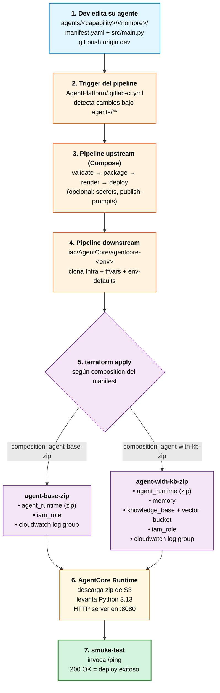

# Fase 0 — MVP de la plataforma AgentCore

> **Objetivo**: versión mínima funcional del framework. Lo justo para deployar un agente Python a AgentCore Runtime y validar el flujo end-to-end. Sin Docker, sin LeanIX, sin tools/gateways custom.

## ¿Qué incluye esta fase?

### Componentes CI/CD (9)
- `validate_manifest` — JSON-schema del manifest
- `validate_structure` — cross-validation manifest ↔ código
- `package_artifact` — zip del agente + upload a S3
- `upload_secret` — CI vars → AWS Secrets Manager (solo si el agente lo necesita)
- `publish_prompt` — Bedrock Prompt Management (opcional por workload)
- `render_tfvars` — manifest + env-defaults → terraform.auto.tfvars.json
- `trigger_iac` — multi-project trigger al deployable
- `smoke_test` — invocación post-deploy de `/ping`
- `pipeline_telemetry` — TRACE_ID propagado para auditoría

### Composiciones Terraform (2)
- **`agent-base-zip`** — runtime + observability. Para agentes simples sin memory ni KB.
- **`agent-with-kb-zip`** — runtime + memory + knowledge_base + observability. Para chatbots RAG.

### Foundations (3)
- `bootstrap` — KMS keys, S3 buckets de artefactos, IAM role base del runtime
- `default-gateways` — 3 gateways AgentCore por defecto del ambiente
- `vpc-endpoints` — endpoints privados a Bedrock/S3/ECR/etc.

### Módulos Terraform (todos los 11)
Se mantienen todos los módulos del repo global aunque algunos no se usen en las composiciones de fase 0. Esto facilita evolucionar a fase 1 sin tener que volver a copiar código.

### Deployables (3 ambientes)
- `agentcore-dev`, `agentcore-qa`, `agentcore-prd`

## ¿Qué NO incluye? (vs versión completa del repo)

| Componente excluido | Por qué |
|---------------------|---------|
| `build_image` | No usamos Docker en fase 0 |
| `scan_image` | Sin imágenes que escanear |
| `apply_policy` | Cedar policies son avanzadas, sin gateways custom |
| `publish_leanix` | Sin catálogo en MVP |
| `drift_check` | Operación continua, no MVP |
| `deploy_agent`/`deploy_mcp`/`deploy_tool` | Macros que envuelven los componentes — innecesarias en pipeline simplificado |

| Composition excluida | Por qué |
|----------------------|---------|
| `agent-base` (container) | Reemplazada por `agent-base-zip` |
| `agent-chatbot` | Variante de agent-base, no necesaria |
| `agent-with-tools` | Necesita gateways custom — fase 1+ |
| `agent-with-kb` (container) | Reemplazada por `agent-with-kb-zip` |
| `mcp-server` | Más complejo, fase 1+ |
| `tool-lambda` | Fase 1+ |
| `gateway-deploy` | Fase 1+ |

## Diferencia técnica clave: zip mode vs container mode

El módulo `runtime` en fase 0 usa **`code_configuration`** del provider AWS:

```hcl
agent_runtime_artifact {
  code_configuration {
    entry_point = ["main.py"]
    runtime     = "PYTHON_3_13"
    code {
      s3 {
        bucket = "artifacts-dev-agentcore-agents"
        prefix = "platform-test/hello-agent.zip"
      }
    }
  }
}
```

vs la versión global que usa **`container_configuration`**:

```hcl
agent_runtime_artifact {
  container_configuration {
    container_uri = "12345.dkr.ecr.us-east-1.amazonaws.com/agent:v1"
  }
}
```

**Implicancias**:
- ✅ Build más simple: `zip src/` en lugar de `docker buildx --platform linux/arm64`
- ✅ Sin ECR repos por workload
- ✅ Cold start más rápido (zip < container image)
- ❌ Limitado a Python (no Go, no Node, no compiled binaries)
- ❌ Sin dependencias system-level (solo lo que pip puede instalar)
- ❌ Tamaño máximo del zip más restrictivo

## Flujo end-to-end: del `git push` al agente corriendo en AWS

Resumen de qué pasa entre que un dev pushea su agente y termina invocable en AWS Bedrock AgentCore.



### Tiempos típicos

| Stage | Duración |
|-------|----------|
| validate (manifest + structure) | 10-30 s |
| package (zip + upload S3) | 10-30 s |
| render (tfvars) | 5-10 s |
| deploy (terraform apply) | 2-5 min |
| smoke (ping) | 5-15 s |
| **Total end-to-end** | **3-8 minutos** |

### Quién es responsable de qué

| Etapa | Responsable |
|-------|-------------|
| Editar manifest + código | Dev de capability |
| Pipelines (Compose) | Equipo de plataforma |
| Componentes Python | Equipo de plataforma |
| Módulos + composiciones Terraform | Equipo de plataforma + revisión arquitectura |
| Cuenta AWS + IAM | Equipo de plataforma + cloudops |

Para el detalle paso a paso de cómo poner todo en marcha, ver [`TUTORIAL.md`](TUTORIAL.md). Para la arquitectura interna ver [`resumen.md`](resumen.md).

## Estructura del directorio

```
fase0/
├── README.md                            # ← este archivo
├── AgentPlatform/                       # workloads MVP
│   ├── .gitlab-ci.yml
│   ├── README.md
│   └── agents/_template/
│       ├── manifest.yaml                # schema simplificado
│       └── src/main.py                  # mock agent stdlib
├── Componentes-AgentCore/               # 9 componentes solamente
│   ├── src/
│   ├── templates/
│   └── config_files/
├── Compose-AgentCore/                   # pipelines minimal
│   ├── pipeline_deploy_agents.yml
│   ├── pipeline_infra.yml
│   ├── pipeline_foundation.yml
│   ├── rules/
│   └── variables/
├── Infra-AgentCore/
│   ├── modules/                         # los 11 módulos (todos)
│   ├── compositions/
│   │   ├── agent-base-zip/              # NUEVO
│   │   └── agent-with-kb-zip/           # NUEVO
│   ├── foundation/                      # 3 foundations
│   │   ├── bootstrap/
│   │   ├── default-gateways/
│   │   └── vpc-endpoints/
│   └── scripts/
└── iac/AgentCore/                       # 3 deployables
    ├── agentcore-dev/
    ├── agentcore-qa/
    └── agentcore-prd/
```

## Cómo se relaciona con el repo global

Esta carpeta es **autocontenida**. Cualquier cambio aquí NO afecta el código de la versión completa del repo (`/Componentes-AgentCore/`, `/Compose-AgentCore/`, `/Infra-AgentCore/`, `/iac/AgentCore/`, `/AgentPlatform/`).

Cuando un componente o composition demuestre ser estable en fase 0, se puede promover al repo global como mejora.

## Cómo subirlo a GitLab (futuro)

Si querés correr los pipelines de fase 0:

1. Crear un grupo nuevo en GitLab, ej: `agentcore-platform-fase0`
2. Replicar la jerarquía de subgrupos (`Componentes/`, `Componentes/Compose/`, `iac/AgentCore/`)
3. Pushear cada subdirectorio como repo separado (mismo método que usamos para el repo global)
4. **Ajustar las cross-references** en los `.gitlab-ci.yml` y templates para apuntar al nuevo namespace:
   - `Componentes/agentcore` → `agentcore-platform-fase0/Componentes/agentcore`
   - `Componentes/Compose/agentcore` → `agentcore-platform-fase0/Componentes/Compose/agentcore`
   - `iac/AgentCore/infra-agentcore.git` → `agentcore-platform-fase0/iac/AgentCore/infra-agentcore.git`
5. Configurar variables CI/CD a nivel de grupo (ver `CI_VARIABLES.md` en raíz del proyecto)

## Cómo validar localmente

### Terraform

```bash
cd fase0/Infra-AgentCore
brew install opentofu  # o terraform si ya lo tenés
./scripts/tf-check.sh           # fmt -check + validate end-to-end
```

### Python (componentes)

```bash
cd fase0/Componentes-AgentCore
pip install -r src/requirements.txt
# pytest tests/  # los tests están en el repo global
```

## Path hacia fase 1+

Cuando fase 0 esté validada productivamente, el camino para escalar:

1. **Fase 1**: agregar `build_image` + `scan_image` para soportar también container mode (workloads que necesiten dependencias no-Python)
2. **Fase 2**: agregar tools-Lambda y composition `agent-with-tools-zip`
3. **Fase 3**: agregar MCP server + composition `mcp-server-zip`
4. **Fase 4**: agregar `apply_policy` (Cedar) para gobierno fino de gateways
5. **Fase 5**: agregar `publish_leanix` + catálogo organizacional
6. **Fase 6**: federación cross-account (descentralización)

Cada fase es **incremental**: agrega capacidades sin romper lo anterior. Ver `docs/01_IMPROVEMENTS_AND_FUTURE_WORK.md` (raíz) para el backlog completo.

## Estado de validación

- ✅ Terraform `tofu validate` pasa
- ⏸️ `terraform apply` pendiente (bloqueado por quota AgentCore en cuenta nueva)
- ⏸️ Pipelines GitLab pendientes (no subido aún a GitLab)
